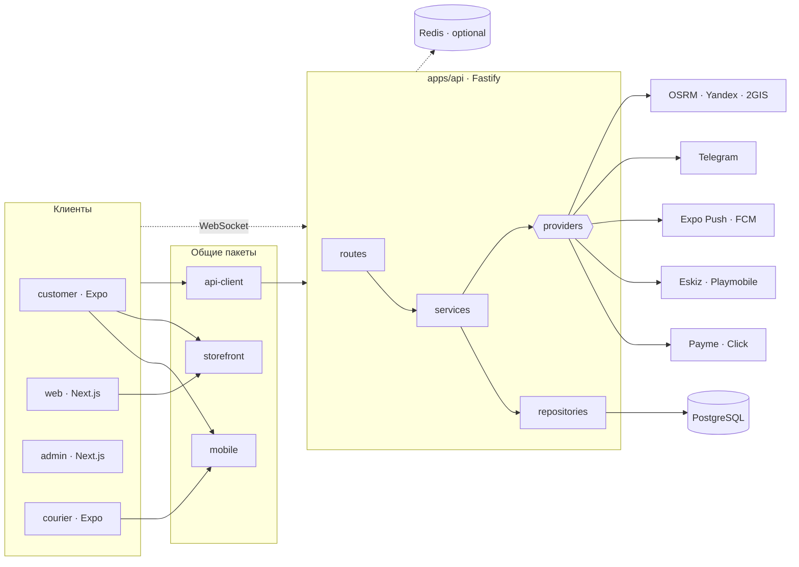

<h1 align="center">🧺 Bazar Delivery</h1>

<p align="center">
  <b>Доставка с базаров, из магазинов и от локальных продавцов — Узбекистан.</b><br/>
  Один заказ — свежая зелень с Чорсу, мясо из лавки за углом и лепёшки из тандыра, за 40 минут.
</p>

<p align="center">
  <a href="https://github.com/Nightcall7442/B.Delivry/actions/workflows/ci.yml"></a>
  
  
  
  
  
  
  
  
  
</p>

<p align="center">
  <a href="#-что-внутри">Что внутри</a> ·
  <a href="#-архитектура">Архитектура</a> ·
  <a href="#-быстрый-старт">Быстрый старт</a> ·
  <a href="#-демо">Демо</a> ·
  <a href="#-разработка">Разработка</a> ·
  <a href="#-интеграции">Интеграции</a> ·
  <a href="#-документация">Документация</a>
</p>

---

## ✨ Что внутри

Платформа из пяти приложений и общего ядра. Покупатель заказывает с карты, продавец подтверждает
и взвешивает, курьер везёт, диспетчер видит всё. Живые статусы, курьер на карте и оплата — по WebSocket.

| | Для кого | Что умеет |
|---|---|---|
| 🛒 | **Покупатель** — `apps/customer` (Expo), `apps/web` (Next.js) | адрес по пину на карте, базары и магазины рядом, каталог с ценами «за кг / за пучок», корзина на несколько точек, слоты доставки, оплата Payme / Click / наличными / с баланса, трекинг курьера, чат, отзывы с фото, чаевые |
| 🧑‍🌾 | **Продавец** — кабинет в `apps/admin` | цены и остатки, фото прилавка «сейчас», «сегодня привезли», торг («попросить скидку»), взвешивание с фото, выручка |
| 🛵 | **Курьер** — `apps/courier` (Expo) | смена, офферы рядом, маршрут, код передачи, заработок; режим «курьер махалли» |
| 🎛️ | **Диспетчер** — `apps/admin` | заказы и доставки вживую, назначение курьеров, компании и счета, аналитика спроса, реклама точек, брендинг (white-label) |
| 🏢 | **B2B** | оплата по счёту, накладные, «каждый рабочий день», подписки на корзину |

<details>
<summary><b>Продуктовые «фишки», которых нет у конкурентов</b></summary>

- **Торг с продавцом** — «попросить скидку» в корзине, ответ в кабинете, цена действует сутки.
- **Список словами** — текст, диктовка или фото бумажного списка (OCR `rus`+`uzb`) → корзина.
- **Прилавок сейчас** — утреннее фото витрины и сторис точек на главной.
- **Гарантия свежести и страховка опоздания** — обращение с экрана заказа 2 ч после доставки; опоздание > 20 мин возвращает доставку на баланс автоматически.
- **Праздничные режимы** — Рамазан, Навруз, Курбан: свои наборы и главная.
- **Кросс-базар** — несколько точек одного базара одной доставкой и одним курьером.
- **Семейная корзина** и **заказ другому человеку** (получателю — SMS при выезде курьера).
- **Bazar Plus** — подписка, кешбэк 3 % на баланс, реферальные коды.
- **Telegram-бот** — трекинг, повтор заказа, статусы в чат.
- **Два языка** — `ru` и `uz` везде, включая SMS и бота; тёмная тема.

</details>

## 🏗 Архитектура

Модульный монолит с чистыми границами: тонкие контроллеры, бизнес-логика в сервисах,
persistence в репозиториях, внешние системы за провайдерами. Каждый модуль готов
выделиться в сервис без переписывания (см. [ADR](docs/decisions/README.md)).



- **Мультитенантность**: `tenantId` в моделях, контекст арендатора на каждом запросе, брендинг через `Tenant.branding`.
- **Статусы заказа** — единая state machine в `@bazar/constants`; переходы валидируются на сервере.
- **Деньги** — целые тийины (`Money { amount, currency }`), никаких float.
- **Redis необязателен** — без него кеш, сессии, лимитер, очередь и крон живут в памяти процесса.

### Структура репозитория

```
apps/
  api/        Fastify + Prisma — 24 модуля: auth, orders, delivery, payments, pricing, haggle, …
  customer/   Expo SDK 57 — приложение покупателя (expo-router)
  courier/    Expo SDK 57 — приложение курьера
  web/        Next.js 15 — витрина покупателя (карта + bottom sheet), SSR
  admin/      Next.js 15 — диспетчерская, кабинет продавца, B2B, аналитика
packages/
  storefront/ чистая логика витрины: цены, слоты, корзина, симуляция заказа, праздники
  mobile/     общий UI Expo-приложений: тема, примитивы, BottomSheet, иконки
  api-client/ типизированный клиент REST + WebSocket
  types/ validation/ constants/ i18n/ auth/ maps/ payments/ notifications/ utils/ ui/ config/
infrastructure/  docker · nginx · prometheus · grafana · loki · jaeger
docs/            архитектура · API · БД · безопасность · деплой · ADR · roadmap
tests/           e2e (Playwright) · integration · load
```

### Стек

| Слой | Технологии |
|---|---|
| Монорепо | pnpm workspaces · Turborepo · TypeScript strict · ESLint · Prettier |
| Backend | Node 22 · Fastify 5 · Prisma 6 · PostgreSQL 18 · Zod · BullMQ (опц.) · ioredis (опц.) |
| Web | Next.js 15 · React 19 · Tailwind · TanStack Query · React Hook Form · MapLibre / Yandex Maps 3.0 |
| Mobile | Expo SDK 57 · React Native 0.86 · expo-router · Reanimated 4 · expo-image · expo-blur |
| Качество | Vitest · Jest (Expo) · Playwright · GitHub Actions |
| Наблюдаемость | OpenTelemetry · Prometheus · Grafana · Loki · Jaeger |

## 🚀 Быстрый старт

Нужны **Node 22** (`.nvmrc`) и **pnpm 10** (`corepack enable`).

```bash
git clone https://github.com/Nightcall7442/B.Delivry.git bazar-delivery && cd bazar-delivery
cp .env.example .env            # секреты: openssl rand -hex 32 × 3
pnpm install                    # только из корня — см. «Разработка»
```

<table>
<tr><th>Без Docker (по умолчанию)</th><th>С Docker</th></tr>
<tr><td>

Postgres 18 поднимается из npm-бинарников, данные в `apps/api/.local/pg`, порт `5433`:

```bash
pnpm --filter @bazar/api db:local     # оставить запущенным
pnpm --filter @bazar/api db:migrate   # миграции
pnpm --filter @bazar/api db:seed      # справочники + демо-магазины
```

</td><td>

Postgres на `5432` + Redis; в `.env` поменять порт в `DATABASE_URL` и заполнить `REDIS_URL`:

```bash
pnpm docker:up
pnpm db:migrate
pnpm --filter @bazar/api db:seed
```

</td></tr>
</table>

Затем — приложения, каждое в своём терминале:

```bash
pnpm --filter @bazar/api dev        # http://localhost:4000/health   API + WebSocket
pnpm --filter @bazar/web dev        # http://localhost:3000          покупатель (web)
pnpm --filter @bazar/admin dev      # http://localhost:3001          диспетчерская
pnpm --filter @bazar/customer dev   # Expo Go — покупатель
pnpm --filter @bazar/courier dev    # Expo Go — курьер
```

## 🎬 Демо

После `db:seed` в базе один арендатор, география Узбекистана, 8 категорий, **6 точек и 24 товара** (Чорсу, Алайский, Юнусабад…) и служебные аккаунты. Вход — по OTP; при `SMS_PROVIDER=console` код не уходит в SMS, а показывается на странице **`/dev/sms`** (`http://localhost:4000/dev/sms`, обновляется сама).

| Роль | Телефон |
|---|---|
| Диспетчер | `+998710000000` |
| Продавец (все 6 точек) | `+998710000001` |
| Курьеры | `+998710000002` (скутер) · `+998710000003` (велосипед) |
| Покупатель | **любой номер** — регистрируется при первом входе |

История для покупателя одной командой — адреса, два доставленных заказа с отзывом,
один заказ в пути с курьером на карте, кешбэк на балансе. Всё через настоящий API:

```bash
cd apps/api && node scripts/demo-data.mjs +998901234567
```

**Телефон не в той же Wi-Fi?** Metro и API можно вывести наружу без регистраций:

```bash
cd apps/api && node scripts/tunnel.cjs                    # → https://….boltexpo.dev  (API)
cd apps/customer && npx expo start --tunnel               # QR для Expo Go
```

и указать URL API в `apps/customer/.env` (`EXPO_PUBLIC_API_URL`). Подробности — в `.env.example` приложения.

## 🛠 Разработка

| Команда | Что делает |
|---|---|
| `pnpm typecheck` · `pnpm lint` · `pnpm test` | по всем пакетам через Turborepo |
| `pnpm test:e2e` | Playwright |
| `pnpm db:studio` | Prisma Studio |
| `pnpm --filter @bazar/api db:migrate` | новая миграция из `schema.prisma` |
| `pnpm format` | Prettier |
| `pnpm check:structure` | проверка соглашений о структуре модулей |

Соглашения, о которые легко споткнуться:

- **`pnpm install` только из корня.** У Expo-приложений нет собственного `.npmrc`: установка из папки приложения переключает workspace в плоский layout и ломает Metro.
- Относительные импорты в `apps/api` и пакетах — **с расширением `.js`** (NodeNext на сервере, Bundler в пакетах — работает в обоих).
- Пакеты **source-only** (`main: ./src/index.ts`) — без шага сборки; Metro читает их `exports` (`apps/customer/metro.config.js`).
- Локали: `ru` — эталон, `uz` — полный; `en` — заглушка. Новые строки добавляются в `@bazar/i18n` сразу для обеих.
- Каждый модуль API начинается с докблока-спецификации — читайте его перед правкой.

## 🔌 Интеграции

| Что | Провайдеры | Заметки |
|---|---|---|
| Платежи | **Payme** (Merchant API), **Click** (SHOP API), наличные, баланс | колбэки `/webhooks/payments/{payme,click}`; песочница — `PAYME_CHECKOUT_URL=https://checkout.test.paycom.uz` |
| SMS / OTP | Eskiz, Playmobile, `console` (dev) | `console` запрещён в production схемой env |
| Push | Expo Push, FCM | |
| Telegram | бот через вебхук `${API_BASE_URL}/webhooks/telegram` | `/orders`, `/repeat`, статусы в чат; без токена — «сухой» режим в лог |
| Карты и маршруты | OSRM · Yandex Maps 3.0 · 2GIS; на клиенте MapLibre + OpenFreeMap без ключа | |
| Хранилище | локальное · S3-совместимое (SigV4 вручную, без SDK) | фото товаров пока с Wikimedia Commons — до своего бакета |
| OCR | tesseract.js (`rus`+`uzb`, модели в `apps/api/.tessdata`) | для «списка словами» по фото |

## 🗺 Roadmap

Разработка идёт «волнами» — [docs/roadmap.md](docs/roadmap.md):

| Волна | Тема | Статус |
|---|---|---|
| 0 | Фундамент: API, схема, платежи, доставка, трекинг | ✅ |
| 1 | Запуск с лицом: витрина карта + sheet, Expo-клиент, uz/ru | ✅ |
| 2 | Возвращаемость: подписки, Plus, кешбэк, рефералы, чат, чаевые | ✅ |
| 3 | То, чего нет у конкурентов: торг, список словами, праздники, семейная корзина | ✅ |
| 4 | Масштаб и B2B: счета, реклама, махалля, кросс-базар, white-label | ✅ |
| 5 | Мобильный визуал: редизайн Expo-клиента, сторис, тёмная тема | ✅ |
| — | Сборки EAS, собственное хранилище фото, `en`, нагрузочные тесты | ⏳ |

## 📚 Документация

[Архитектура](docs/architecture/README.md) ·
[Модули backend](docs/architecture/modules.md) ·
[API](docs/api/README.md) ·
[База данных](docs/database/README.md) ·
[Безопасность](docs/security/README.md) ·
[Деплой](docs/deployment/README.md) ·
[Дизайн мобильного клиента](docs/design-mobile.md) ·
[ADR](docs/decisions/README.md)

## 📄 Лицензия

Проприетарное ПО, © 2026 Bazar Delivery. См. [LICENSE](LICENSE).
